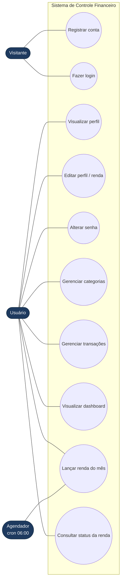
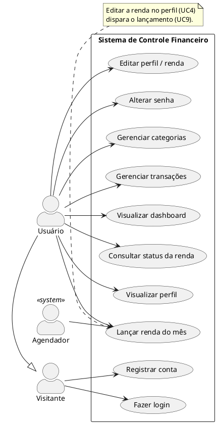

# Diagrama de Casos de Uso

O diagrama de casos de uso descreve o sistema sob a ótica de **quem o utiliza** e **o que cada ator consegue fazer**. Ele não detalha implementação: serve para delimitar o escopo funcional do Controle Financeiro.

## Atores

| Ator | Descrição |
|------|-----------|
| **Visitante** | Pessoa ainda não autenticada. Só acessa cadastro e login. |
| **Usuário** | Pessoa autenticada (com token JWT válido). Dono das próprias categorias e transações. |
| **Agendador** | Ator de sistema (tempo). Dispara, todo 5º dia útil, o lançamento automático da renda mensal. |

> O `Usuário` é uma especialização do `Visitante`: depois de se autenticar, continua podendo usar os casos de uso públicos, mas ganha acesso a todo o restante.

## Diagrama (Mermaid)

## Diagrama (PlantUML — notação UML canônica)

Use este bloco quando precisar gerar a imagem em notação UML formal (elipses e bonecos). Para renderizar, cole o conteúdo em [plantuml.com/plantuml](https://www.plantuml.com/plantuml/uml/) ou use a extensão *PlantUML* do VS Code.

## Descrição dos casos de uso

| # | Caso de uso | Pré-condição | Fluxo principal |
|---|-------------|--------------|-----------------|
| UC1 | **Registrar conta** | E-mail ainda não cadastrado | Informa nome, e-mail, senha e (opcional) renda mensal → sistema cria a conta, gera categorias padrão, lança a renda do mês corrente e devolve o token. |
| UC2 | **Fazer login** | Conta existente | Informa e-mail e senha → sistema valida (BCrypt) e devolve o token JWT. |
| UC3 | **Visualizar perfil** | Autenticado | Sistema retorna nome, e-mail e renda mensal do usuário logado. |
| UC4 | **Editar perfil / renda** | Autenticado | Atualiza nome e renda mensal; ao salvar a renda, o lançamento do mês é reprocessado. |
| UC5 | **Alterar senha** | Autenticado; senha atual correta | Confere a senha atual e grava o novo hash. |
| UC6 | **Gerenciar categorias** | Autenticado | Cria, lista, edita e exclui categorias (não permite excluir categoria com transações). |
| UC7 | **Gerenciar transações** | Autenticado; categoria válida | Cria, lista (paginado), edita e exclui receitas/despesas. |
| UC8 | **Visualizar dashboard** | Autenticado | Mostra saldo, receitas/despesas do mês, gastos por categoria e fluxo de 6 meses. |
| UC9 | **Lançar renda do mês** | Renda mensal > 0 | Lança a renda como receita no 5º dia útil; pode ser disparado manualmente ou pelo Agendador. |
| UC10 | **Consultar status da renda** | Autenticado | Informa se a renda do mês já foi lançada e qual a próxima data prevista. |

### Relações `<<include>>` e `<<extend>>`

- **UC4 → UC9** (`<<include>>` na prática): salvar a renda no perfil aciona o lançamento da renda do mês.
- **UC1 → UC9** (`<<include>>`): ao registrar a conta com renda informada, o lançamento já é executado.
- Todos os casos de uso do `Usuário` **incluem implicitamente** a validação do token JWT, feita pelo filtro de segurança antes de chegar ao controlador.
