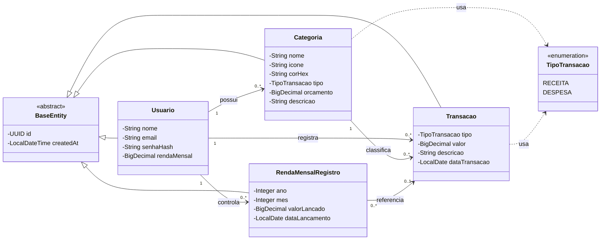
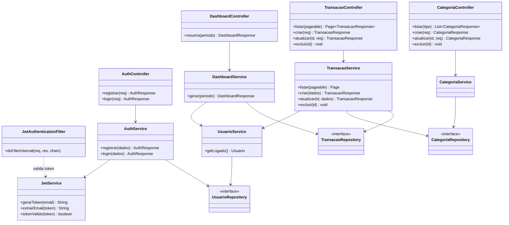

# Diagrama de Classes

O sistema segue uma arquitetura em camadas (*Controller → Service → Repository*). Este documento traz dois recortes complementares:

1. **Modelo de domínio** — as entidades persistidas (o que vira tabela no banco).
2. **Visão de camadas** — como controladores, serviços e repositórios se relacionam.

---

## 1. Modelo de domínio (entidades)

Todas as entidades herdam de `BaseEntity`, que centraliza o identificador (`UUID`) e a data de criação. O tipo de uma categoria ou transação é representado pelo enum `TipoTransacao`.

### Multiplicidades e regras

| Relação | Multiplicidade | Observação |
|---------|----------------|------------|
| Usuário → Categoria | 1 : 0..* | Cada usuário tem suas próprias categorias (criadas por padrão no registro). |
| Usuário → Transação | 1 : 0..* | Toda transação pertence a um usuário. |
| Categoria → Transação | 1 : 0..* | Uma categoria não pode ser excluída se tiver transações. |
| Usuário → RendaMensalRegistro | 1 : 0..* | Um registro por usuário/ano/mês (chave única). |
| RendaMensalRegistro → Transação | 0..* : 0..1 | Aponta para a receita gerada, para rastreabilidade. |

---

## 2. Visão de camadas (arquitetura)

Recorte da arquitetura para uma requisição autenticada. O `JwtAuthenticationFilter` intercepta a requisição antes de chegar ao controlador; os serviços concentram a regra de negócio e usam os repositórios para acessar o banco.

> Os repositórios são interfaces Spring Data JPA — não há implementação manual: o Spring gera as consultas a partir do nome dos métodos (ex.: `findByUsuarioIdAndDataTransacaoBetween`).
