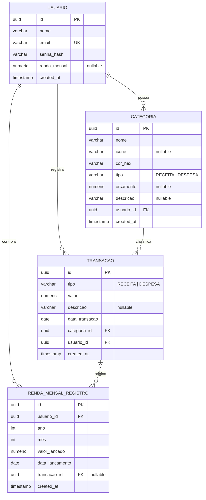

# Modelo Lógico Relacional

Este documento descreve como o domínio é persistido no **PostgreSQL**. O esquema é gerado pelo Hibernate (`ddl-auto: update`) a partir das entidades JPA; o DDL abaixo é a representação equivalente em SQL.

## Diagrama Entidade-Relacionamento



## Dicionário de dados

### `usuario`
| Coluna | Tipo | Restrições | Descrição |
|--------|------|-----------|-----------|
| id | UUID | PK | Identificador. |
| nome | VARCHAR(150) | NOT NULL | Nome do usuário. |
| email | VARCHAR(255) | NOT NULL, UNIQUE | Login. |
| senha_hash | VARCHAR(255) | NOT NULL | Senha em hash BCrypt (nunca texto puro). |
| renda_mensal | NUMERIC(15,2) | NULL | Renda usada no lançamento automático. |
| created_at | TIMESTAMP | NOT NULL | Data de criação. |

### `categoria`
| Coluna | Tipo | Restrições | Descrição |
|--------|------|-----------|-----------|
| id | UUID | PK | Identificador. |
| nome | VARCHAR(100) | NOT NULL | Nome (único por usuário). |
| icone | VARCHAR(50) | NULL | Ícone exibido na interface. |
| cor_hex | VARCHAR(7) | NOT NULL, default `#6B7280` | Cor em hexadecimal. |
| tipo | VARCHAR(20) | NOT NULL | `RECEITA` ou `DESPESA`. |
| orcamento | NUMERIC(15,2) | NULL | Limite de gasto planejado. |
| descricao | VARCHAR(255) | NULL | Texto livre. |
| usuario_id | UUID | NOT NULL, FK → usuario(id) | Dono da categoria. |
| created_at | TIMESTAMP | NOT NULL | Data de criação. |

### `transacao`
| Coluna | Tipo | Restrições | Descrição |
|--------|------|-----------|-----------|
| id | UUID | PK | Identificador. |
| tipo | VARCHAR(20) | NOT NULL | `RECEITA` ou `DESPESA`. |
| valor | NUMERIC(15,2) | NOT NULL | Valor do lançamento. |
| descricao | VARCHAR(255) | NULL | Texto livre. |
| data_transacao | DATE | NOT NULL | Data do lançamento. |
| categoria_id | UUID | NOT NULL, FK → categoria(id) | Categoria. |
| usuario_id | UUID | NOT NULL, FK → usuario(id) | Dono. |
| created_at | TIMESTAMP | NOT NULL | Data de criação. |

### `renda_mensal_registro`
| Coluna | Tipo | Restrições | Descrição |
|--------|------|-----------|-----------|
| id | UUID | PK | Identificador. |
| usuario_id | UUID | NOT NULL, FK → usuario(id) | Dono do registro. |
| ano | INTEGER | NOT NULL | Ano de referência. |
| mes | INTEGER | NOT NULL | Mês de referência (1–12). |
| valor_lancado | NUMERIC(15,2) | NOT NULL | Valor lançado como receita. |
| data_lancamento | DATE | NOT NULL | Quando o sistema lançou. |
| transacao_id | UUID | NULL, FK → transacao(id) | Receita gerada (rastreabilidade). |
| created_at | TIMESTAMP | NOT NULL | Data de criação. |
| — | — | **UNIQUE (usuario_id, ano, mes)** | Impede lançamento duplicado no mesmo mês. |

## Script DDL (PostgreSQL)

```sql
CREATE TABLE usuario (
    id           UUID PRIMARY KEY,
    nome         VARCHAR(150) NOT NULL,
    email        VARCHAR(255) NOT NULL UNIQUE,
    senha_hash   VARCHAR(255) NOT NULL,
    renda_mensal NUMERIC(15,2),
    created_at   TIMESTAMP NOT NULL DEFAULT now()
);

CREATE TABLE categoria (
    id         UUID PRIMARY KEY,
    nome       VARCHAR(100) NOT NULL,
    icone      VARCHAR(50),
    cor_hex    VARCHAR(7)  NOT NULL DEFAULT '#6B7280',
    tipo       VARCHAR(20) NOT NULL,
    orcamento  NUMERIC(15,2),
    descricao  VARCHAR(255),
    usuario_id UUID NOT NULL REFERENCES usuario(id),
    created_at TIMESTAMP NOT NULL DEFAULT now()
);

CREATE TABLE transacao (
    id             UUID PRIMARY KEY,
    tipo           VARCHAR(20)  NOT NULL,
    valor          NUMERIC(15,2) NOT NULL,
    descricao      VARCHAR(255),
    data_transacao DATE NOT NULL,
    categoria_id   UUID NOT NULL REFERENCES categoria(id),
    usuario_id     UUID NOT NULL REFERENCES usuario(id),
    created_at     TIMESTAMP NOT NULL DEFAULT now()
);

CREATE TABLE renda_mensal_registro (
    id              UUID PRIMARY KEY,
    usuario_id      UUID NOT NULL REFERENCES usuario(id),
    ano             INTEGER NOT NULL,
    mes             INTEGER NOT NULL,
    valor_lancado   NUMERIC(15,2) NOT NULL,
    data_lancamento DATE NOT NULL,
    transacao_id    UUID REFERENCES transacao(id),
    created_at      TIMESTAMP NOT NULL DEFAULT now(),
    CONSTRAINT uk_renda_usuario_ano_mes UNIQUE (usuario_id, ano, mes)
);
```

## Normalização

O modelo está na **3ª Forma Normal (3FN)**:

- **1FN** — todos os atributos são atômicos; não há grupos repetitivos.
- **2FN** — não há chaves compostas com dependência parcial (as PKs são `UUID` simples).
- **3FN** — não há dependência transitiva: atributos como `cor_hex` ou `valor` dependem apenas da chave primária da sua própria tabela. O `tipo` da transação é redundante em relação ao da categoria por decisão de projeto (permite uma transação avulsa diferir da categoria), e não caracteriza violação.
