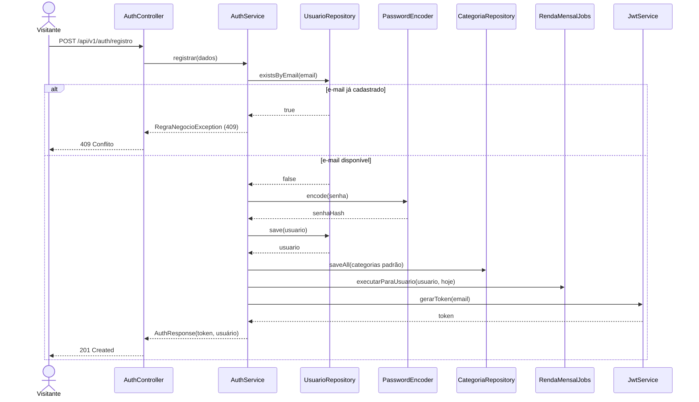
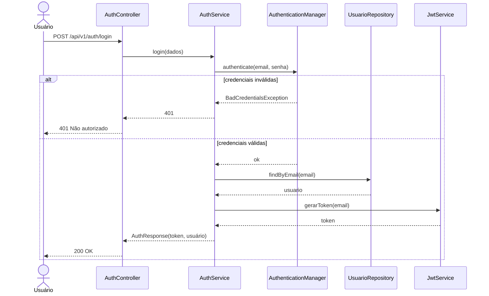
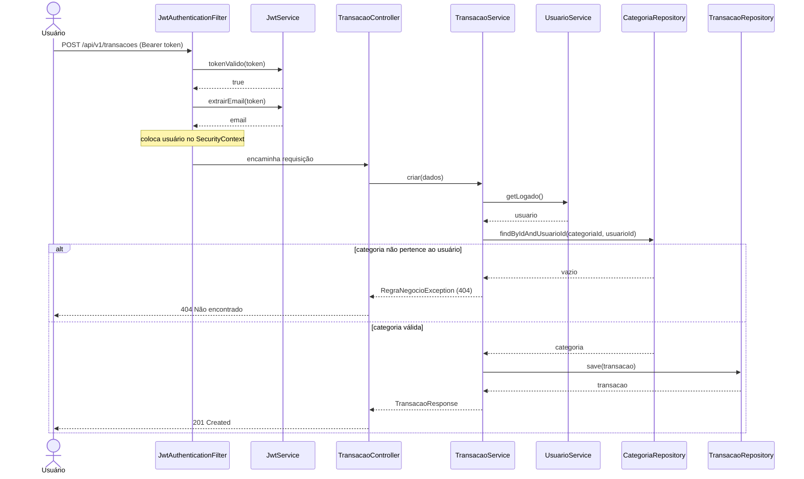
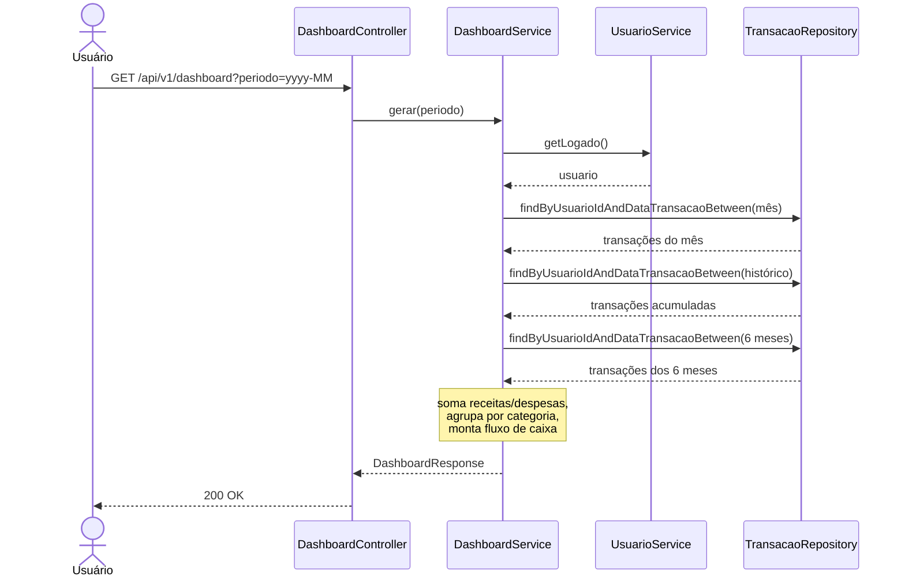
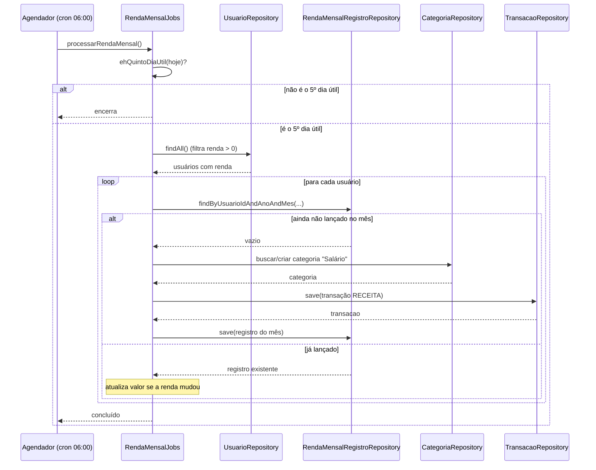

# Diagramas de Sequência

Os diagramas a seguir mostram a troca de mensagens entre os participantes ao longo do tempo. Foram escolhidos quatro fluxos que, juntos, exercitam toda a arquitetura: autenticação, escrita autenticada, leitura agregada e processamento agendado.

---

## 1. Registro de conta

Ao registrar, o sistema valida o e-mail, grava o usuário com senha em hash, cria as categorias padrão, já lança a renda do mês (se informada) e devolve o token.

---

## 2. Login

A autenticação delega ao `AuthenticationManager` do Spring Security, que compara a senha informada com o hash. Se válida, gera o token JWT.

---

## 3. Criar transação (requisição autenticada)

Mostra o ciclo completo de uma escrita protegida: o filtro JWT autentica a requisição **antes** do controlador, e o serviço garante que a categoria pertence ao usuário logado.

---

## 4. Visualizar dashboard (leitura agregada)

O dashboard não tem tabela própria: ele é calculado a partir das transações do usuário no período escolhido.

---

## 5. Lançamento automático da renda mensal (job agendado)

Todo dia às 06:00 o agendador dispara a rotina; ela só age se a data for o 5º dia útil do mês. Para cada usuário com renda configurada, lança a receita uma única vez por mês.

> O mesmo método `executarParaUsuario(...)` é chamado fora do agendador — no registro da conta, ao salvar a renda no perfil e pelo botão **Lançar renda do mês** — garantindo que o dashboard reflita a renda imediatamente, sem esperar o próximo dia 5.
